[toc]

## 引导界面

启动app，会有一个引导界面（3秒），且第一次登录的话，进入引导界面，还会有几张图显示，如下所示：

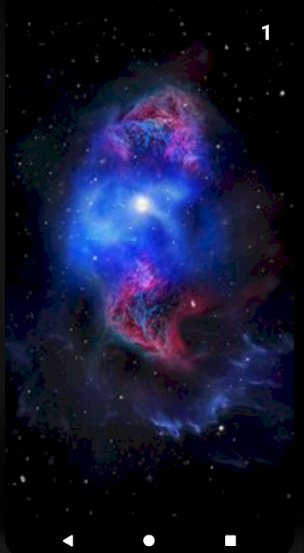

向左滑动可以进入下一张图，当然，向右滑动也可以进入前一张图，在最后一张图任意位置点击即可进入主界面。

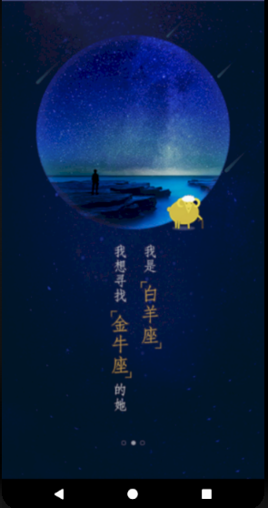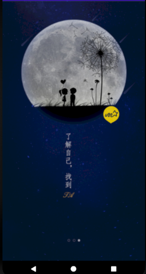

## 1.主界面

主界面显示如下：

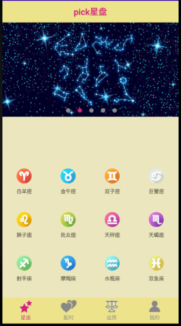

这里，主界面由三个部分组成，一个是最上方的标题栏（TextView），一个是下面的RadioGroup（其中包含四个RadioButton，用来切换中间的显示），最后就是中间的一个LinearLayout。用来加载四个RadioButton点击后要显示的内容。

这里四个RadioButton分别对应四个Fragment，然后用一个FragmentManager对象统一管理。并用FragmentTransaction对象处理这四个Fragment的显示和隐藏。当点击某一个按钮时，另外三个按钮所对应的Fragment隐藏，且他们的RadioButton变暗。

## 2.星座界面

刚运行时，中间的LinearLayout显示的是星座的Fragment，他的布局是上方一个ViewPager用来显示一个可以滑动并显示多张图片的一个控件，几个原点是一个LinearLayout布局，只不过是跟着图片的变化跟着让相应的点并称粉红色，其他的点显示灰色。

下面是一个GridView，这里我设置让他每四个显示一行。然后给每个GridView下的Item也设置一个布局，后边定义并创建其适配器，并使用GridView的对象，设置其为该控件的适配器，便可将内容添加到GridView中。

顺便说下，每个Item的布局是一个CircleImageView（需要添加依赖de.hdodenhof.circleimageview.CircleImageView）和一个TextView。每个按钮点击后会把其对应的xzcontent.json文件的信息传入下一个活动StarAnalysisActivity中。

这里，我们以金牛为例，点击后，显示如下：

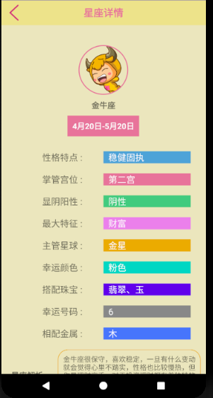

这里使用LinearLayout布局，从上往下显示的控件依次是：首先加载title布局，然后是CircleImageView（显示星座logo）、TextView（显示星座名）、TextView（显示星座生日范围）。最后是一个ListView，然后我们给ListView下的每一个子项配置一个item_layout。然后在活动界面使用自制的AnalysisBaseAdapter适配器加载内容后显示。

其他星座也一样，下面给出几个示例（白羊、双鱼、巨蟹）：

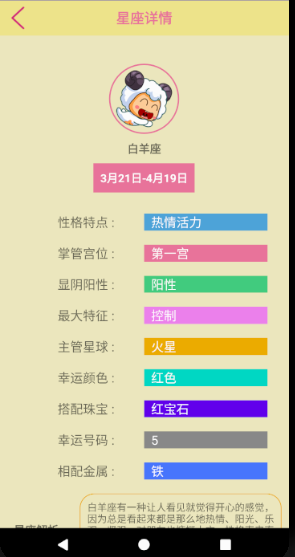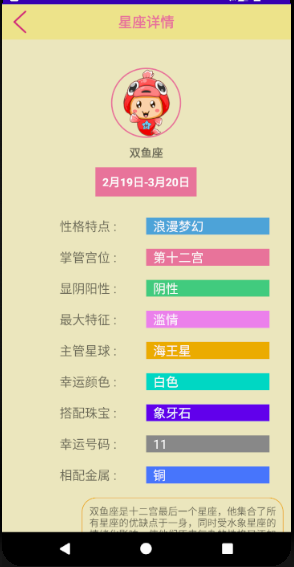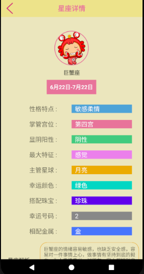

点击上方的 < 按钮可以回到上一级界面：

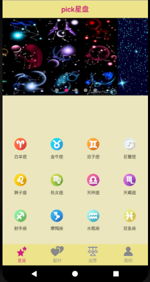

## 3.配对界面

点击配对按钮，显示如下：

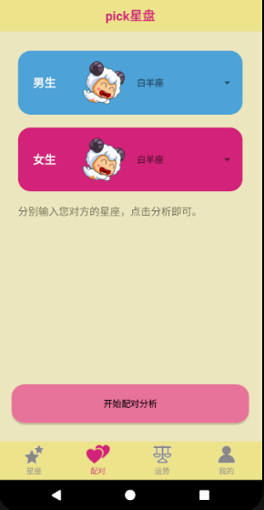

这里，我们可以选择男女双方各自的星座，点击开始配对分析按钮，系统会调用聚合数据的星座配对API，然后把两个星座的信息传入，得出结果后，再把信息传到本机显示。（该功能需要联网）

例如：男生是金牛座，女生是处女座，配对信息如下：

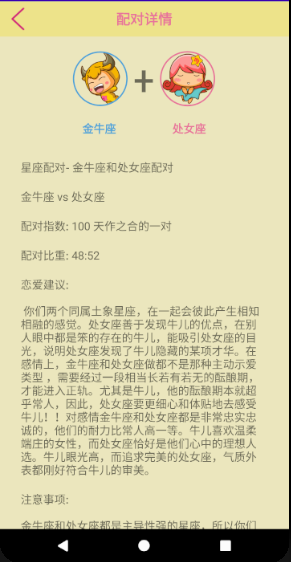

这里的数据除了金牛座和他的logo都取自聚合数据，没有联网的话是显示不了的。点击<按钮可以回到上级界面：

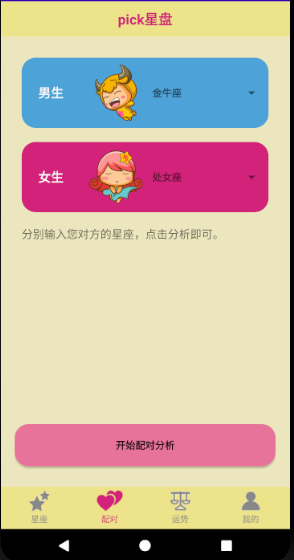

## 4. 运势界面

点击运势按钮，显示如下：

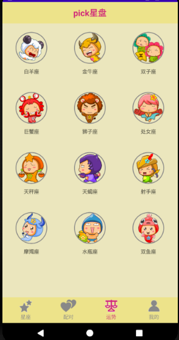

这里可以查看每个星座今年的运势，数据来源也是聚合数据的星座运势API。比如，我们点击金牛，显示如下：

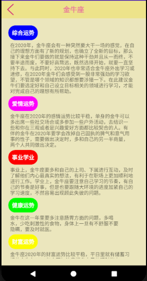

这里的<按钮点击后，依然可以回到我们上级界面，如下：

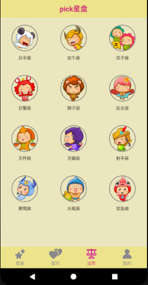

## 5.我的界面

点击第四个按钮我的，显示界面如下：

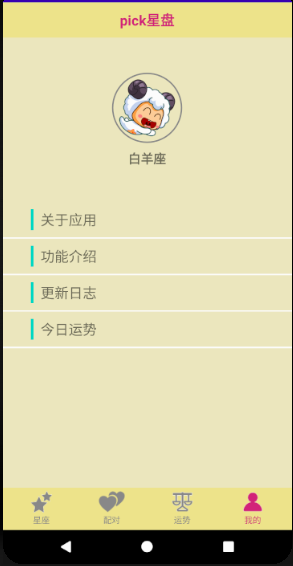

这里我们可以点击白羊logo更换自己的星座，比如，我是金牛，点击白羊logo后，显示如下：

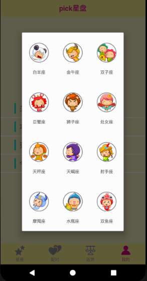

可以看到，他会弹出一个dialog，然后我们选择金牛，该dialog会结束，然后更换自己的logo，如下：

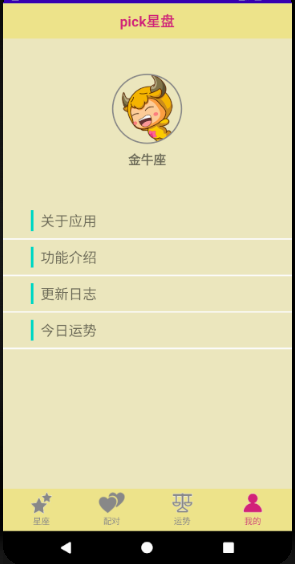

点击关于应用，显示如下：

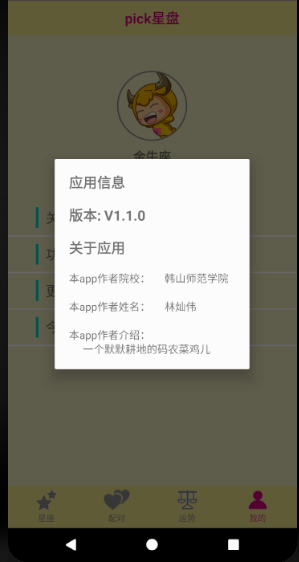

点击任意位置可以取消这个dialog，然后我们再点击功能介绍，显示如下：

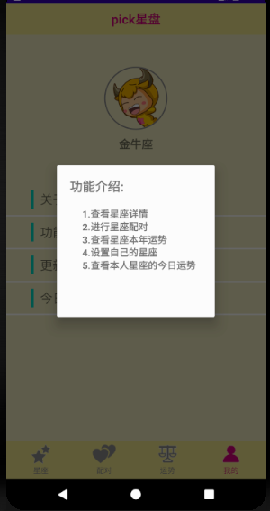

点击更新日志，显示如下：

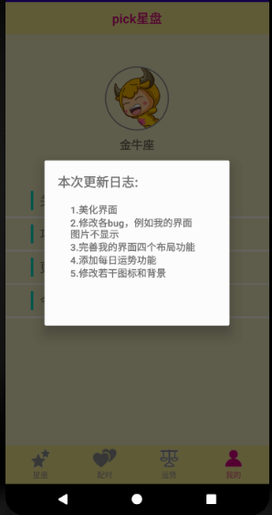

点击今日运势，他则会根据上边自己选择的自己的星座去聚合数据那边调用他的星座运势的每日运势的API，然后将得到的数据返回，显示如下：

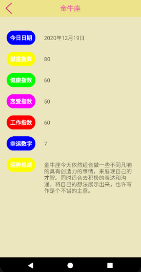

