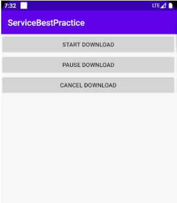
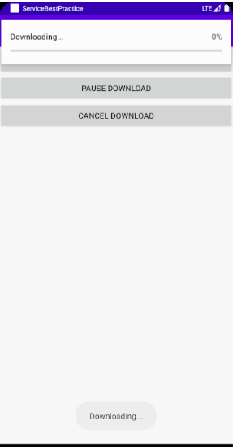
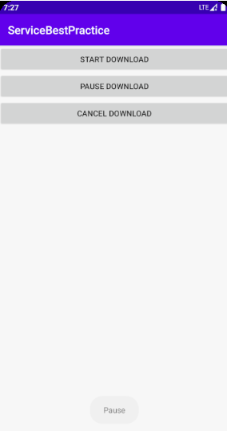
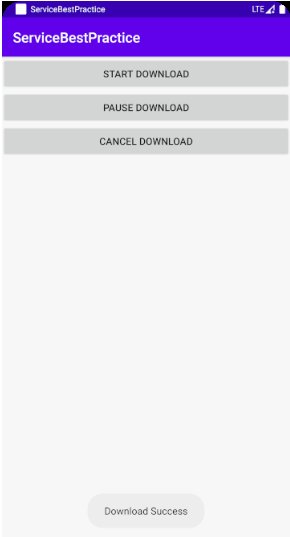
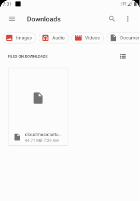
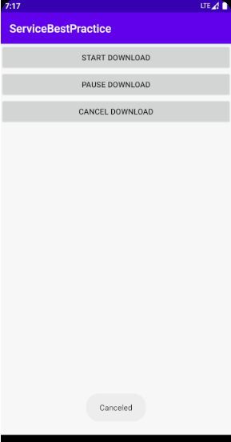

### 实验目的：

 了解子服务的绑定，子服务代码运行在异步任务 

### 实验内容：

首先，我们运行app，显示如下：

点击START DOWNLOAD按钮，显示如下：

点击PAUSE DOWNLOAD按钮，能暂停下载，如下：

然后我们继续点击START DWONLOAD按钮，让他接着下载，下载完成时，会显示：

进入SD卡中的Download目录下，可以看到该文件已经存在，说明确实下载完成，如下:

下载过程中，我们还可以点击CANCEL DOWNLOAD，取消下载，关闭通知，并删除下载的文件。

### 实验总结：

学会了子服务的绑定以及如何让子服务代码运行在异步任务中 