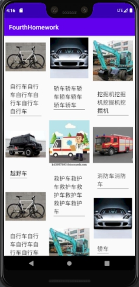
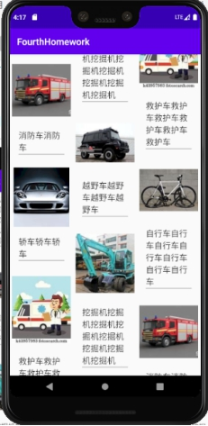
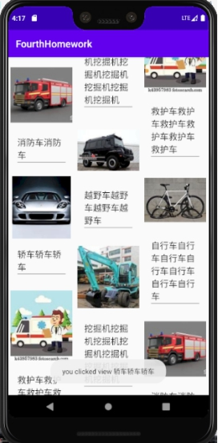
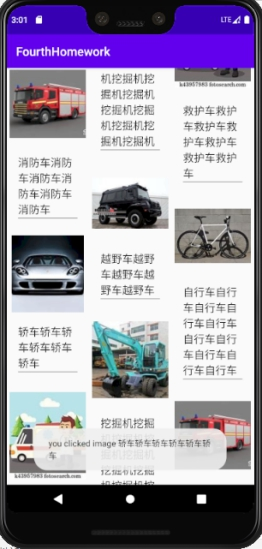
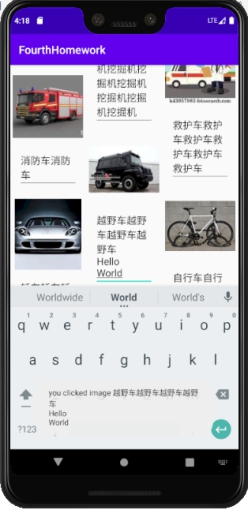
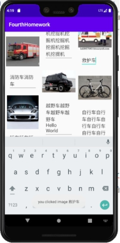

实验目的：

掌握RecyclerView的使用以及EditText的监听事件

实验内容：

首先，我们运行app，显示如下：

 

向下滑动，界面如下：

 

点击轿车的图片以及点击文字上方，图片下方空白区域，显示如下：

 

 

可以看到，虽然很像，但是点击图片显示的是clicked image，点击空白处显示的是clicked view.

下面，我们在越野车后边加上Hello World，然后点击图片查看效果，显示如下：

 

显然，他输出的内容已经发生了变化，多了HelloWorld两行

我们也可以对其进行删除，比如我们让右边的救护车的名字只剩下救护车三个字，如图所示：

 

由Toast的输出结果可知，EditText的监听事件无误。

***\*实验总结：\****

***\*通过对RecyclerView和TextEdit监听事件的学习，对Android的界面设计以及监听机制有了更深的了解。\****