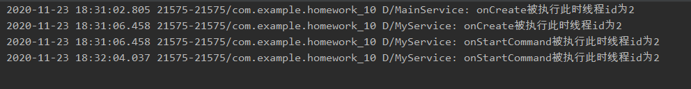

[toc]

### 1.创建服务

这里onBind是Service类的一个抽象类，必须重写，即使我在这里其实并没有真正使用到他。

每次创建服务还得记得在Manifest文件中进行注册。

### 2.设置布局

这里LinearLayout嵌套了一个RelativeLayout布局，还有两个按钮，而RelativeLayout的中间位置布置了一个TextView。

### 3.初始化界面

初始化主界面的两个按钮和一个文本框，并未两个按钮设置监听器，来对服务的启动和停止进行操控。

这里之所以把TextView设置为静态是因为想要直接通过MainActivity.textView来控制文本框的内容而无需去new一个新的界面。

### 4.编写AsyncTask的子类Task

该类主要用于线程间的异步传输，因为子线程无法修改UI线程的界面，所以，要通过new一个Task的对象，然后该对象通过调用execute()方法来调用onPreExecute和doInBackground方法。

这里的doInBackground也是运行在一个子线程中，因此不能对UI界面做修改，他又通过调用publishProgress()方法来调用onProgressUpdate方法，该方法在主线程中运行，可以对界面进行修改。

至于最后的onPostExecute方法这里并没有用到，但为了熟悉AsyncTask的使用架构，我还是把他给贴出来了。

### 5.编写服务的三个周期函数

这里onCreate、onStartCommand、onDestroy三个方法都运行在主线程，要想开辟子线程还得重新new Thread。

在onStartCommand方法中，task（Task的变量）通过execute()方法调用doInBackground方法，flag用来决定该死循环什么时候暂停。

onDestroy方法只能关闭服务，但是无法关闭服务中已经创建的子线程，因此，这里我们通过把flag设置为false来结束子线程的死循环，并通过task的execute()方法重置UI界面的文本框内容。

### 6.运行结果

初始运行状态如下

点击startService按钮后，可以启动服务并创建子线程，第一个onCreate来自MainActivity，主要是为了看其他的线程是否属于主线程。

这里可以多次点击，会创建不同的线程：

通过Stop Service按钮可以一次将所有的子线程杀死并销毁

