[toc]

## 1.设置ToolBar

### 1.1.隐藏ActionBar

由下图中的android:theme="@style/AppTheme"可知，安卓的主题是由value下的style文件中的AppTheme输定定义的。

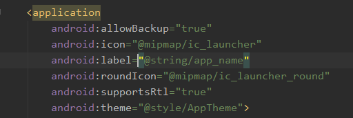

修改主题为NoActionBar，隐藏ActionBar如下：

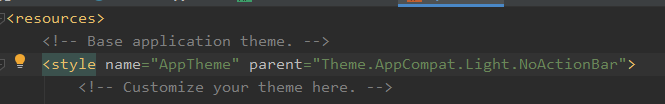

### 1.2.设置activity_main的布局

background设置的是背景色

theme设置的是让ToolBar单独使用深色主题

popupThem设置的是设置弹出的菜单项为浅色主题

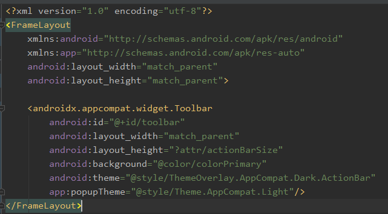

### 1.3.实例化ToolBar

注意，这里导入的ToolBar是

```
import androidx.appcompat.widget.Toolbar;
```

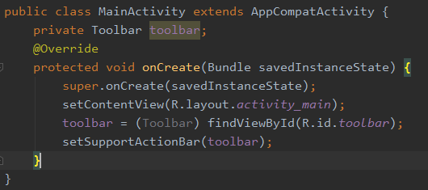

### 1.4.设置ToolBar的名称

android:label用来设置应用显示的名称

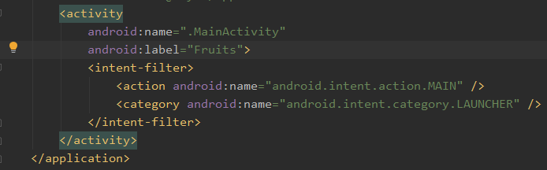

### 1.5.添加Action按钮

item标签用于定义action按钮，app:showAsAction用来指定按钮的位置，可用的值有：always(永远显示在ToolBar，除非屏幕空间不够)、ifRoom(屏幕空间足够的情况下显示在ToolBar，不够的话显示在菜单)、never(永远显示在菜单中)。

注意：ToolBar的action按钮只会显示图标，而菜单中的action按钮只会显示文字。

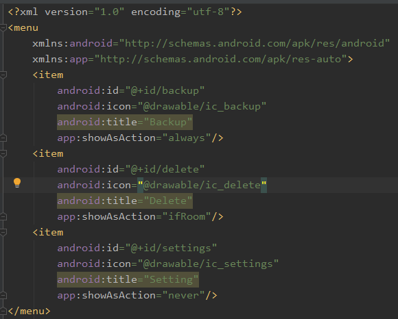

### 1.6.加载toolbar.xml

这里有两个方法，第一个方法是自己写的，getMenuInflater().inflate()方法用来加载toolbar.xml文件，第二个则是处理每一个action按钮的点击事件。

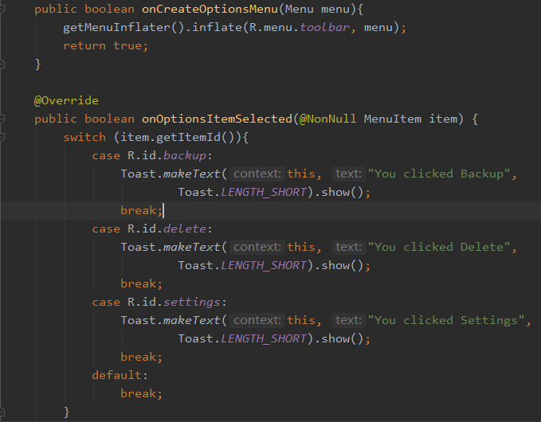

## 2.设置滑动菜单

### 2.1.添加依赖库

下面两行是我添加的依赖库，第一个是Material 库、第二个是CircleImageView。

```
implementation 'com.google.android.material:material:1.0.0'
implementation 'de.hdodenhof:circleimageview:3.0.1'
```

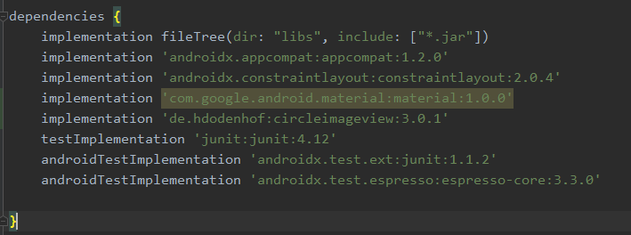

### 2.2.设置布局

设置滑动菜单的下方为五个action按钮，checkableBehavior="single"指定的是菜单项只能单选。

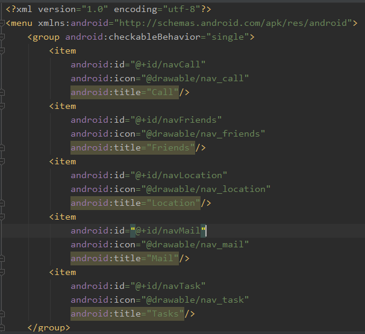

设置滑动菜单上方布局为RelativeLayout，控件为一个圆形的图标和两个文本显示框。

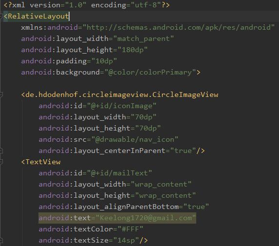

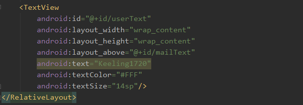

### 2.3.将滑动菜单添加到主界面

这里对之前的布局略有修改，主要还是把FrameLayout放到DrawerLayout中，然后在其下方又加了一个滑动菜单，滑动菜单设置上方的布局和下方的布局，大致如此。

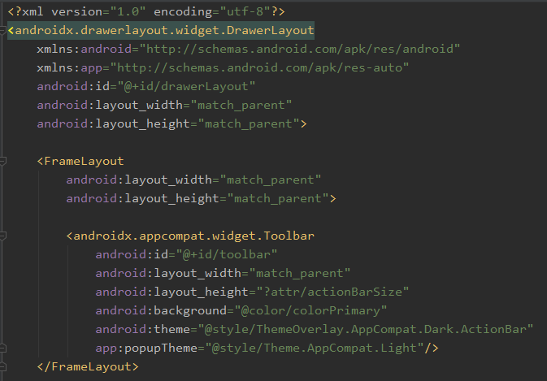

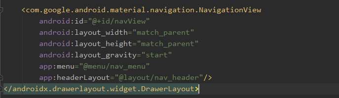

### 2.4.处理滑动菜单的菜单项点击事件

处理HomeAsUp按钮的点击事件，点击后显示滑动菜单。

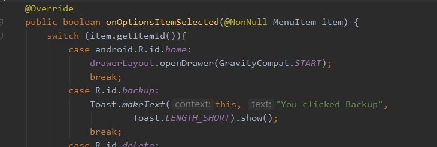

getSupportAcionBar()用来得到ToolBar（本题）的实例，setDisplayHomeAsUpEnable()让导航按钮显示出来，setHomeAsUpIndicator()设置导航按钮图标。

setCheckItem()方法将Call设为默认选中状态

setNavigationItemSelectedListener()方法设置被选中的菜单项的事件监听器，当用户点击后，会调用方法onNavigationItemSelected()方法。

closeDrawers()方法将滑动菜单关闭

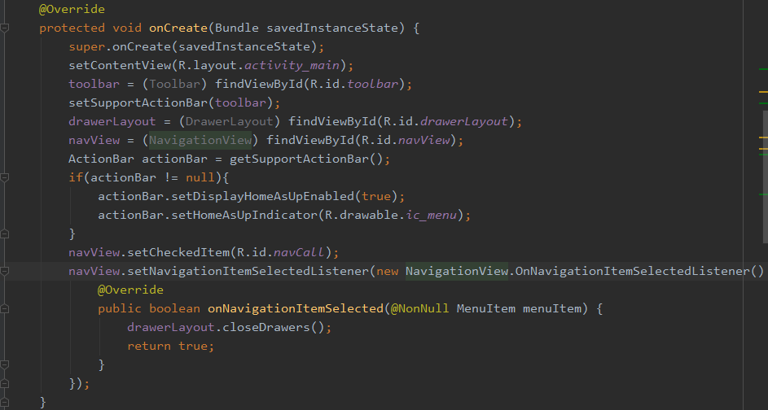

## 3.添加悬浮按钮和可交互提示

### 3.1.添加FloatingActionButton空间

首先，在主界面布局的FrameLayout中添加图中的<com.google.android.material.floatinggactionbutton.FloatingActionButton>，用于添加一个FloatingActionButton，并设置其属性，将其放在主界面的右下角，设置其图标为value/drawable下的图片ic_done，app:elevation可设置其悬浮高度，高度值越大，投影范围越大，但投影效果越淡。

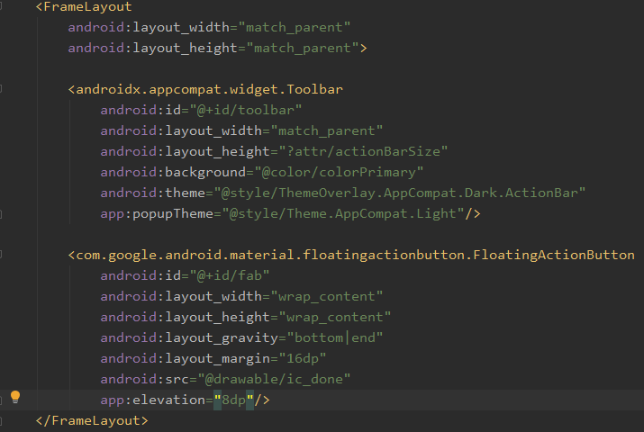

### 3.2实例化FloatingActionButton并设置点击事件处理

这里有几个需要注意的点，首先，他的点击事件是View.onClickListener。然后Toast.makeText不再是只能用this，而得用MainActivity.this，否则会报错。

还有就是介绍一下这个Snackbar，他作为一个更强大的提示工具，可以通过添加setAction来添加选项，点击选项后可以执行其他相应的操作。这里模拟的是误删了某个东西后，点击Undo可以实现数据重载。

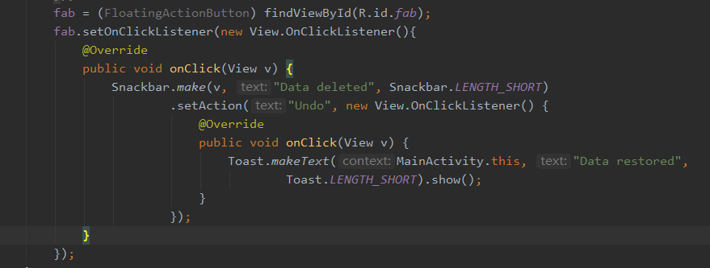

### 3.3.CoordinatorLayout

上面的代码运行后，其实会发现一个问题，就是Snackbar提示将悬浮按钮给遮挡住了，虽然时间不长，但是细节决定成败，因此，我们用CoordinatorLayout来解决这个问题。

其实CoordinatorLayout可以说是一个加强版的FrameLayout，就是比FrameLayout多拥有一些额外的Material功能。

这个比较简单，只要把原本主界面的FrameLayout改为以下语句即可，如果是自动补齐的话，他的尾部也会自动更新（Android Studio特有，其他不晓得）。


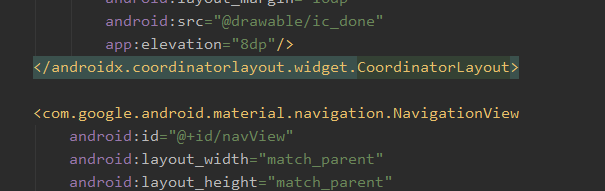

## 4.卡片式布局

### 4.1.添加依赖库

这里第一个是RecyclerView的库，第二个是Glide库，Glide是一个超级强大的开源图片加载库。它可以加载本地图片、网络图片、GIF图片甚至本地视频。

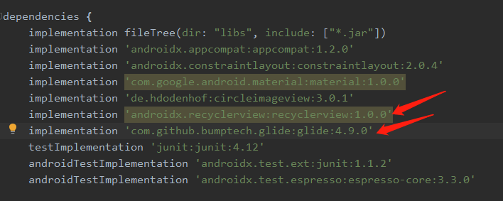

### 4.2.添加RecyclerView布局

在主界面的CoordinatorLayout中添加RecyclerView布局。这里我们设置了其的布局宽度和高度都match_parent，让它能够布满全局。

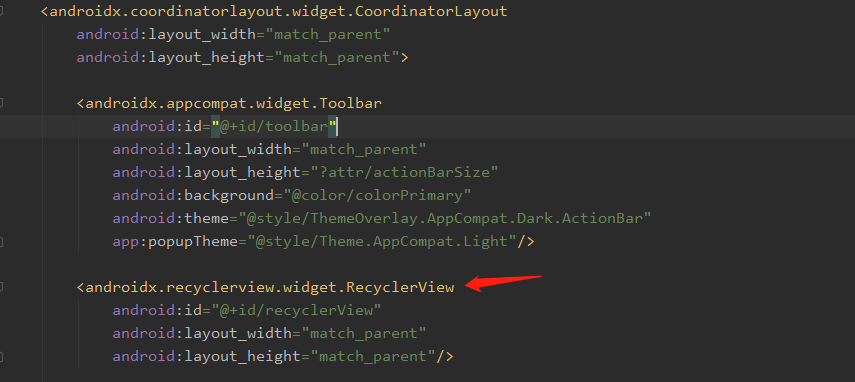

接着我们定义一个Fruit类

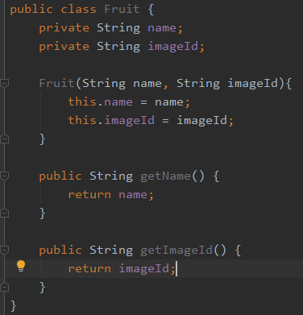

然后，创建一个属于RecyclerView的子项的自定义布局，在layout目录下创建fruit_item.xml

这里，我们采用MaterialCardView作为子项的最外层布局，使得每个RecyclerView的元素都在卡片当中。为了让后边RecyclerView的定位容易些，我们又嵌套了一个LinearLayout，并把每个子项的内容放在其中。内容也比较简单，就是一个图片和一个文本显示框。

内容中唯一陌生的可能就是ImageView中的scaleTyep了，他可以指定图片缩放模式，这里的centerCrop是让图片保持原有比例填满ImageView。并将超出屏幕的部分裁剪掉。


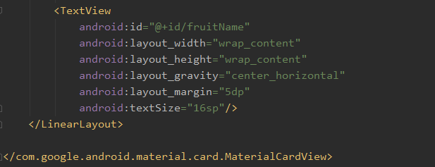

创建RecyclerView的适配器类FruitAdapter


这里唯一需要注意的是，这个地方用的加载图片的方式换成了Glide。Glide的用法也比较简单，首先用Glide.with()传入一个Context、Activity或Fragment参数，然后调用load()加载图片，该图片可以是一个URL地址，也可以是一个本地路径，或者是一个资源id。最后调用into()方法把图片设置到具体某一个ImageView中即可。

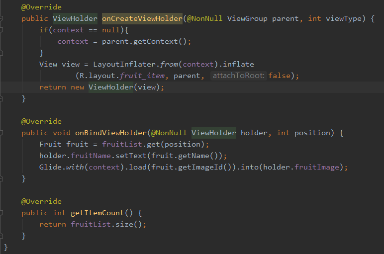

定义一个水果的数组，存放Fruit实例。

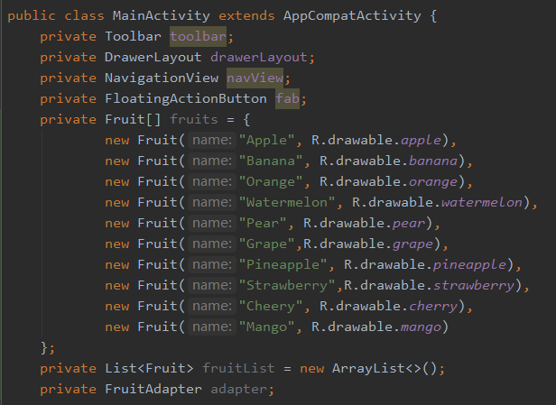

initFruit() 方法清空fruitList中的数据，然后用一个随机函数来使得每次打开程序看到的水果数据都是不同的。

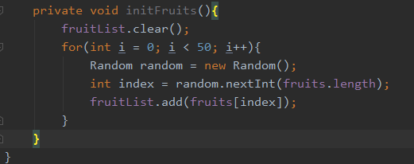

在onCreate()方法调用initFruit后，就是一些RecyclerView的常规操作，值得注意的是，这里用的针对RecyclerView的布局方式是GridLayout，卡片布局，其中第二个参数是列数，即每一行显示多少个item子项。

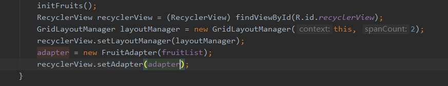

### 4.3.AppBarLayout

以上的代码运行的程序会出现RecyclerView把ToolBar遮挡住的现象，因此，这里我们就需要引入一个AppBarLayout布局，其实就是一个垂直方向的LinearLayout，他在内部做了很多滚动事件的封装，并应用了一些MaterialDesign的设计理念。

解决遮挡问题很简单，只需要两步，首先，把ToolBar内嵌到AppBarLayout中，如下：

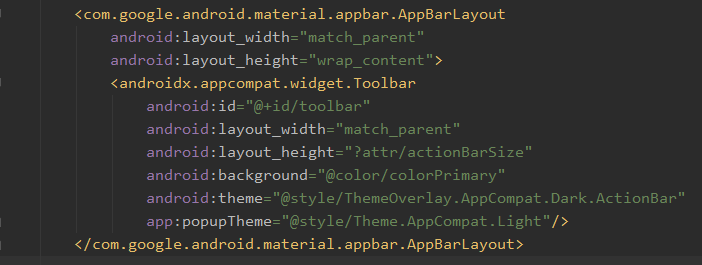

然后，第二步是给RecyclerView指定一个布局行为，如下：

其实就是加一句app:layout_behavior="..."

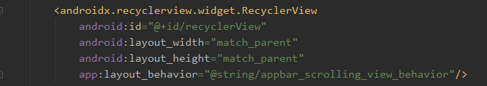

实现RecyclerView向上滚动时，ToolBar隐藏，RecyclerView向下滚动时，ToolBar重新显示，当ToolBar未完全显示或隐藏时，会根据滚动距离自动选择隐藏或者显示，其实只需要加一个属性app:layout_scrollFlags="..."，这里需要注意的是|左右的字符不可以有空格，否则会报错。

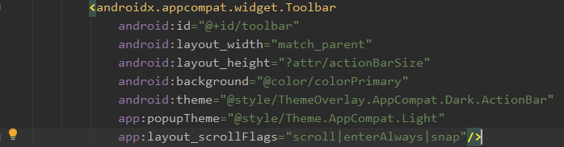

## 5.下拉刷新

### 5.1.SwipeRefreshLayout

在RecyclerView外层嵌一层SwipeRefreshLayout，这样RecyclerView就有下拉刷新功能了。

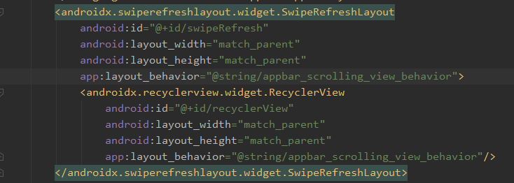

接下来，我们还得在活动中对其进行真正的代码实现才能有相应的功能实现，如下：

首先在onCreate()方法中添加：

setColorSchemeResources()方法用于设置下拉刷新进度条颜色

setOnRefreshListener()方法就是设置一个监听器，当用户下拉时，刷新动作该如何实现

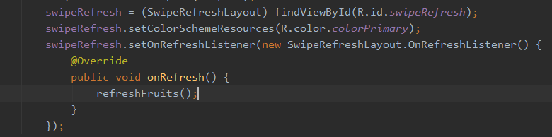

下面这个方法也比较简单，需要提的是runOnUiThread是跑回主线程（界面线程）运行界面的东西，这里就是简单的实现一下对水果的重新排布这样子。notifyDataSetChanged()用来通知数据发生了变化，SwipeRefreshLayout用于表示刷新事件结束，隐藏刷新进度条。

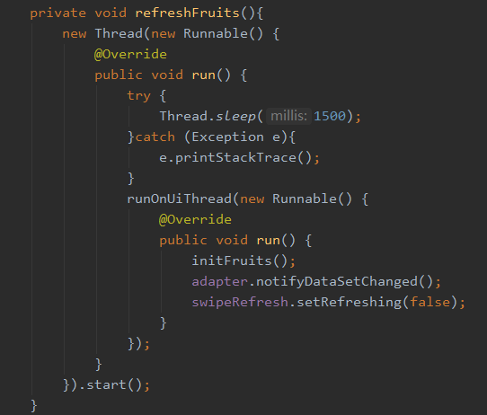

