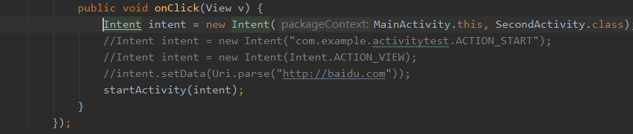
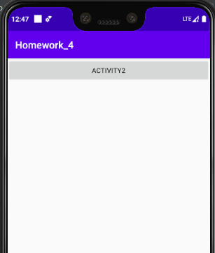
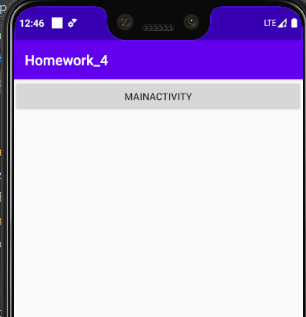
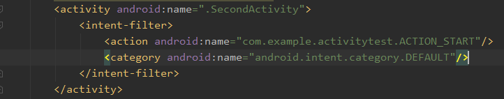
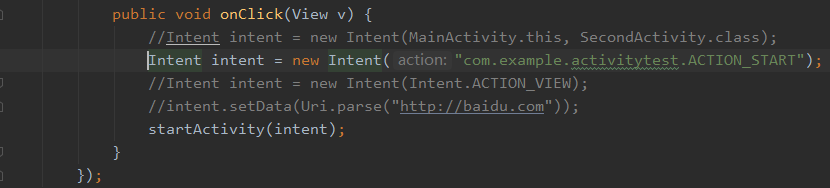
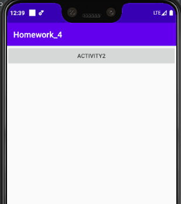
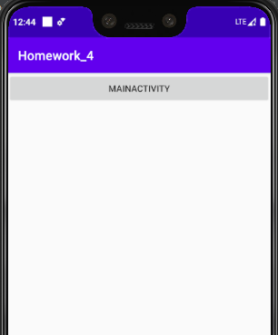
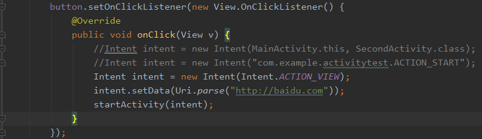
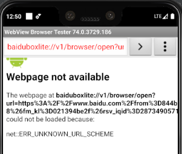
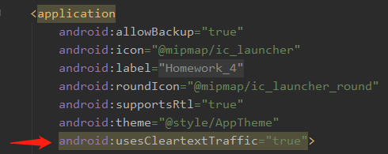

[toc]

### 1.显式调用Intent

显示调用的代码如下：

只需要在Intent方法中传入两个参数，第一个是调用的活动的对象，第二个是被调用的活动的类，即可完成调用。演示如下：

上图是主界面，点击后会显示调用SecondActivity活动，跳转到SecondActivity的界面，如下：

### 2.自定义的Intent的使用

自定义的Intent调用方法，首先得再Manifest文件注册，如下:

在想要自定义的活动下，定义一个action和category，然后将action后的android:name复制

然后再使用Intent()方法调用，这里只需要输入一个参数，即你刚才复制的action后的android:name

初始界面如下：

点击按钮后显示界面如下：

### 3.调用系统内置隐式Intent

要想调用系统内置隐式Intent，首先需要知道系统内置Intent，这里我们使用的是Intent.ACTION_VIEW

Uri.parse的方法是将一个网址字符串解析成一个Uri对象，主要是用来让调用的Intent打开该网址

运行后，点击按钮结果如下：

如果显示的是Webpage not available信息，

那么在Manifest文件添加权限，其实也就是在application中添加一句：

android:usesCleartextTraffic="true"

