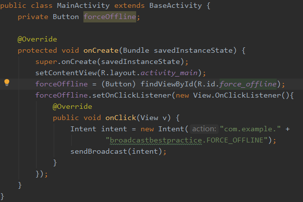

[toc]

### 1.创建类ActivityCollector

ActivityCollector类用于管理所有活动

addActivity用于每次创建活动时自动添加到ActivityCollector类的activities中

remove用来每次销毁活动时自动从ActivityCollector类的activities中移除

finishAll用来结束所有的活动

### 2.创建类BaseActivity

BaseActivity类是所有活动类的父类，即所有活动每次新建都调用一次ActivityCollector.addActivity(),销毁都调用一次ActivityCollector.removeActivity()

### 3.设置登录界面的布局

### 4.修改登录活动

获取用户输入的账号密码，输入正确后点击登录按钮，则进入MainActivity活动界面，否则提示账号或密码错误。

### 5.设置MainActivity界面

### 6.隐式调用自定义Intent

实现按钮forceOffline的功能，点击后隐式调用自定义Intent:com.example.broadcastbestpractice.FORCE_OFFLINE

### 7.创建类ForceOfflineReceiver

类ForceOfflineReceiver是BroadcastReceiver的子类，是自定义的广播接收器，实现的功能是销毁所有活动并启动登录活动，回到登录界面

### 8.动态注册广播接收器

onResume()用于在启动活动的时候动态注册广播接收器，

onPause()用于暂停活动的时候动态销毁广播接收器

### 9.设置登录活动为程序启动的主活动

这里我们把主活动改为.LoginActivity,而.MainActivity只是一个在Manifest注册的一个普通的活动

### 10.运行结果

运行的初始界面如下

输入错误的账号密码，显示界面如下（会提示账号或密码错误）：

输入正确的账号密码，显示界面如下：

点击按钮后，显示如下：

点击确认，会返回登录界面，显示如下：

