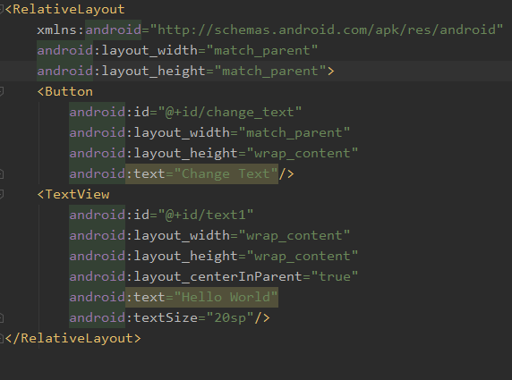
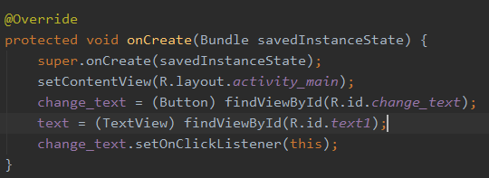
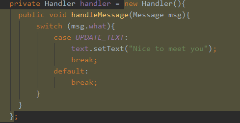
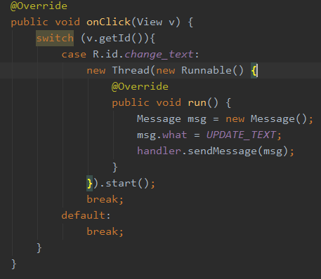
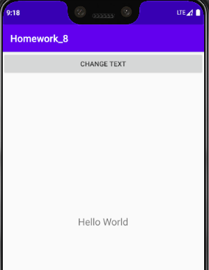
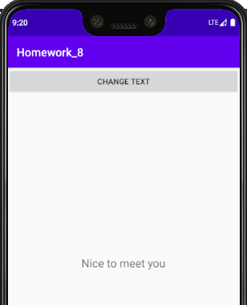

[toc]

### 1.设置UI界面

主界面有一个按钮和一个文本显示框

### 2.初始化界面

使用findViewById初始化界面的按钮和文本显示框，并注册按钮的监听器

### 3.线程间数据的交换

这里主要通过重写Handler父类的handleMessage()方法，来实现对具体的Message进行处理。

只要handler对象调用sendMessage方法，handleMessage方法就会被调用，并接受传过来的Message。

### 4.实现按钮点击传送消息

这里，我们很显然可以看到，开辟了一个子线程，但是由于子线程是无法直接对主线程的界面进行操作的，所以，我们通过点击按钮后，开辟子线程将消息通过handler发给主线程。

主线程接受信息后，自动调用handleMessage方法，把文本显示框的内容更改为Nice to meet you.

### 5.结果显示

初始显示界面如下：

当点击了CHANGE TEXT按钮后，界面显示如下：

显然，点击按钮后，子线程成功将Message信息传递给了主线程。实现了多线程之间的数据交换。

