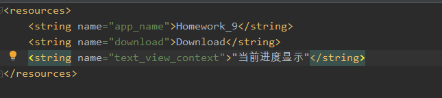
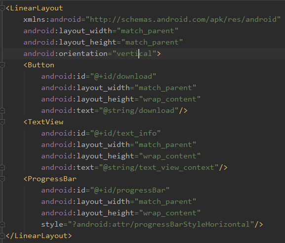
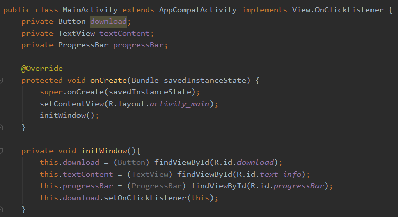
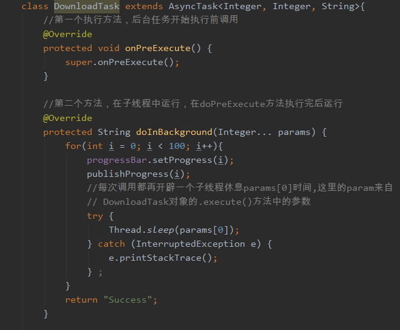
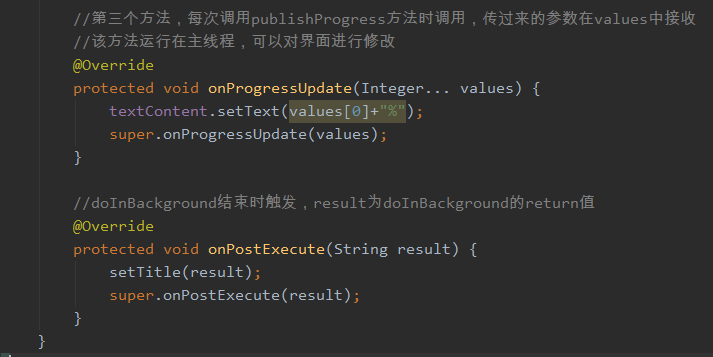
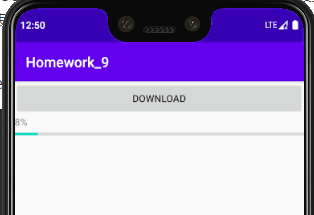

[toc]

### 1.设置string.xml中需要用到的字符串值

如此，后边用到string/download表示的就是Download

string/text_view_context表示的就是当前进度显示

### 2.设置UI界面布局

这里只有一个按钮，一个文本框和一个进度条

### 3.初始化布局

这里把Button、TextView、Progress实例化。

### 4.创建类DownloadTask继承AsyncTask，实现消息异步处理

这里，AsyncTask后边的三个参数，依次由方法doInBackground、onProgressUpdate、onPostExecute三个方法需要的参数类型决定。

第一个方法onPreExecute()在后台任务开始执行前调用，常用来初始化布局，但是，由于我们已经在主线程的onCreate方法中完成布局，所以我这里并没有过多的修饰。

第二个方法doInBackground()方法的**所有代码都会在子线程中运行**，常用来处理耗时的任务，任务一旦完成可以通过return语句将任务的执行结果返回，结束后会主动调用onPostExecute()方法。并将return的信息传递给onPOStExecute()方法中的形参。

doInBackground方法中使用到的publishProgress()方法则会调用onProgressUpdate方法，i会作为onProgressUpdate的形参。

onProgressUpdate方法通过publishProgress调用，接受publishProgress传过来的参数，用values[0]、values[1]表示，这里因为只有一个int传过来，所以只有values[0]，但是不可以因为只有一个int就直接用values当int来使用

onPostExecute方法在doInBackground方法有返回值时调用，接受doInBackground的返回值作为形参result。

### 5.运行结果

运行结果比较简单，就是点击Download按钮后，进度条会根据设置好的移动速度（休眠时间）不断更新自己的进度信息。

