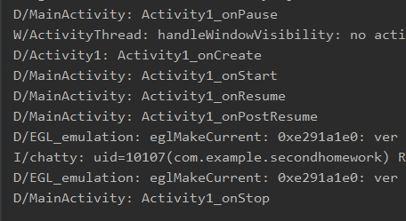

 

如图所示，每个按钮的启动模式不同，且MainActivity（Activity1)为启动的主界面。

活动1，2，3，4的启动模式依次为：standard、singleTop、singleTask、singleInstance。

由Debug可知，启动该APP调用的函数，如下：

 

Activity1调用函数onCreate、onStart、onResume、onPostResume，此时Activity1创建了一个实例对象1.显示界面如下：

 

点击Button1后，调用的函数情况如下：

 

可知，Activity1活动先调用onPause、后用调用了onCreate生成了一个新的Activity1的实例对象2.然后再调用onStart, onResume, onPostResume来显示自己的界面，实例对象1调用onStop暂停自己。此时界面如下：

 

虽然界面相同，但是此时的显示的实例对象是不同的。

***\*由此可知：Activity1的启动模式standard每次都会创建一个新的实例对象\****

此时，再点击Button2，调用函数情况如下：

 

由图可知，实例对象2（Activity1第二个创建的实例对象）调用onPause暂停后Activity2调用onCreate函数创建实例对象3，然后经过onStart、onResume、onPostResume函数启动Activist2的界面后，实例对象2调用onStop暂停。此时的界面显示如下：

 

此时再点击Button2按钮，调用的函数如下：

 

由图可知，此时不会再创建一个新的实例，而是调用onPause后又马上调用onResume和onPostResume函数，且界面不变：

 

此时，我们按Button3，观察其调用过程：

 

此时，实例对象3（Activity2的实例对象）调用onPause暂停，活动Activity3调用onCreate创建实例对象4，然后调用onStart、onResume、onPostResume，之后实例对象3调用onStop停止。

此时的界面如下：

 

此时再点击Button2，调用情况如下：

 

实例对象4（Activity3的实例对象）调用onPause暂停后，Activity2调用onCreate创建了一个新的实例对象5（Activity的第二个实例对象），然后再调用onStart、onResume、onPostResume来显示自己的活动界面，实例对象4则调用onStop停止自己的活动。

***\*由此可知：Activity2的启动方式singleTop处于栈顶时不创建实例对象，但不处于栈顶时便会创建新的实例对象。\****

此时界面显示如下：

 

这时，我们再点击Button3按钮，调用情况如下：

 

实例对象5（Activity2的第二个实例对象）调用onPause暂停，然后实例对象4（Activity3的实例对象）调用onRestart、onStart、onResume和onPostResume打开原来创建的实例对象4，后实例对象5调用onStop停止，再使用onDestroy销毁实例对象4.

***\*由此可知：Activity3的启动方式singleTask只会有一个实例对象，每次启动的时候会检查是否存在该活动的实例，如果已经存在则使用存在的实例对象，并把栈中该活动之上的所有活动销毁（出栈），如果没有，则创建一个新的实例对象。\****

此时显示的界面如下：

 

此时，我们再按Button4，调用情况如下：

 

首先实例对象5（Activity3的实例对象）调用onPause暂停，Activity4调用函数onCreate创建实例对象6（Activity4的实例对象），然后调用onStart、onResume、onPostResume函数显示界面，后实例对象5调用onStop停止。此时显示界面如下：

 

此时我们再点击Button1，创建一个新的实例对象7（Button1的第三个实例对象），此处省略调用过程。

显示结果如下：

 

然后我们按Back键，看调用过程：

 

此时，实例对象7（Activity1的第三个实例对象）暂停，实例对象5（Activity3的实例对象）重启，后实例对象7销毁活动。界面如下：

 

***\*为什么不是Activity4界面，原因是因为singleInstance的启动模式会返回一个新的返回栈。而Activity1的返回栈还是之前Activity1、Activity2和Activity3共用的栈，所以，实例对象7（Activity1的第三个实例对象）Back后返回的是实例对象5（Activity3的实例对象）。\****

之后一直Back的顺序依次是销毁实例对象5（Activity3的实例对象），实例对象3（Activity2的第一个实例对象），实例对象2（Activity1的第二个实例对象），实例对象1（Activity1的第一个实例对象）

最后再是跑到Activity4创建的栈中把实例对象6（Activity创建的实例对象）显示和销毁。

 

由图可知，这里已经回到Activity4活动界面，再点击一次Back后，界面显示如下：

 