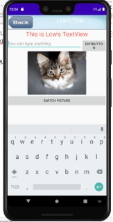
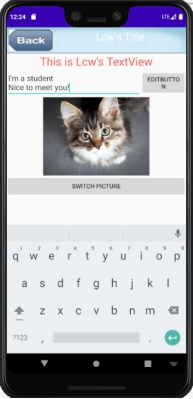
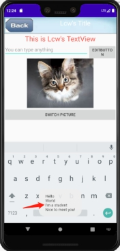
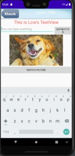
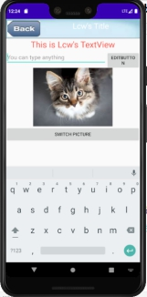
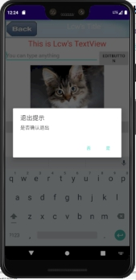
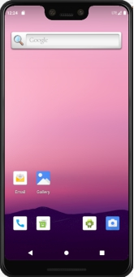

实验目的：掌握第三章UI的几个简单控件：TextView、Button、EditText、ImageView、AlertDialog以及对控件的布局。

实验内容：

首先，我们运行app，界面如下：

 

可以看到，整体的布局是垂直布局，最上面是一个自制的标题栏，标题栏上有一个按钮和一个TextView且TextView中的文字被居中处理。

然后是一个TextView，显示This is Lcw’s TextView

然后是一个水平布局，分别放置一个EditText和一个输出EditText内容的Button。

然后是一个显示图片的ImageView

最后是一个控制图片转换的Button

 

下面，我们在EditText输入我们想输入的内容

Hello

World

I’m a student

Nice to meet you!

界面如下：

 

此时，我们看到，Hello和World两行数据看不到了，原因是因为我设置了maxLines参数为2，接下来，我们点击按钮EDITBUTTON，界面如下：

 

可以看到，此时，Toast输出我们原本的内容，并把EditText置空。

我们再点击SWITCHBUTTON按钮，界面显示如下：

 

显然，原本的猫咪照片变成了狗的照片，再次点击仍会变回猫咪，即每次点击都会在两张图片之间进行切换。下面，给出再次点击的界面图片：

 

最后我们点击标题栏的Back按钮，界面显示如下：

 

可以看到，弹出了一个会话框，询问是否确认退出，点击否则返回应用界面，点击“是”结果如下：

 

应用将退出并返回桌面。

***\*实验总结：通过自己编写一个简单的界面，并且实现各控件之间的协调运作，对Android的界面以及布局有了更深一步的了解。\****